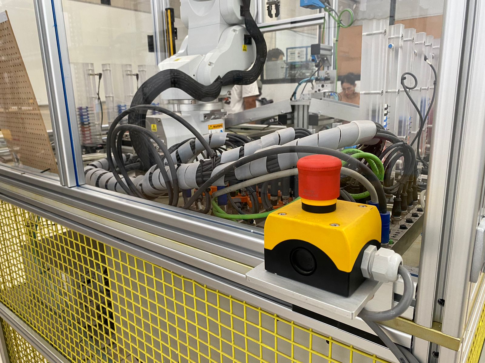
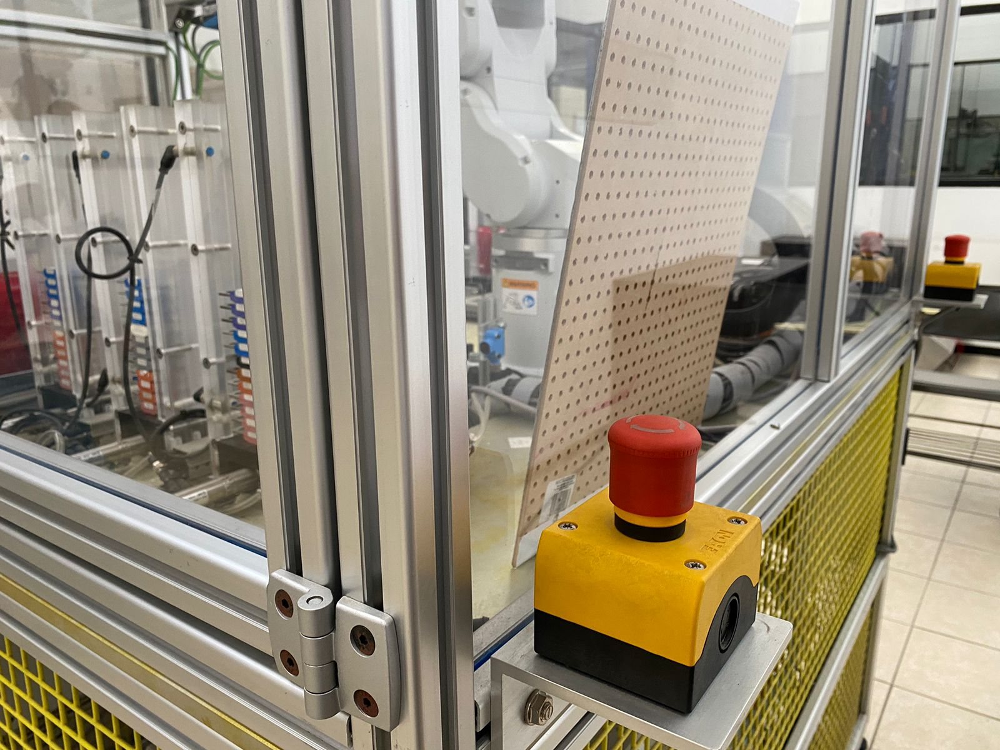
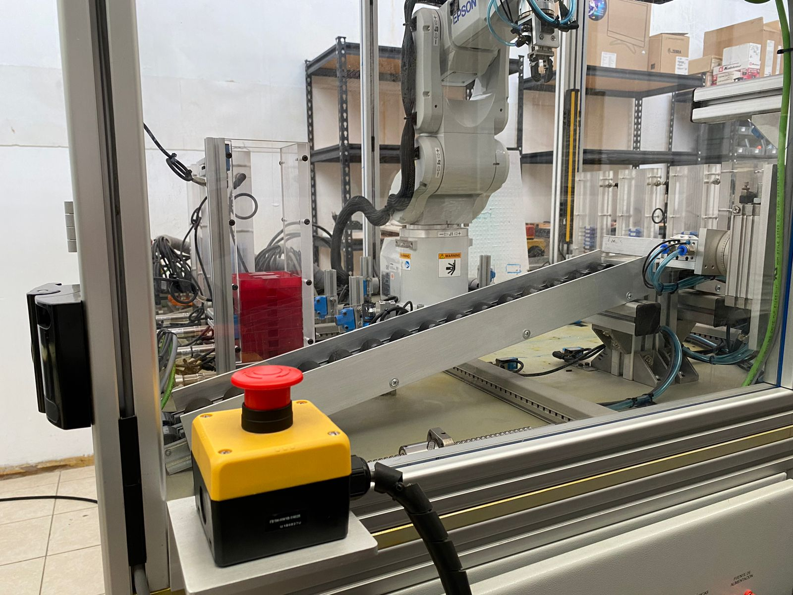
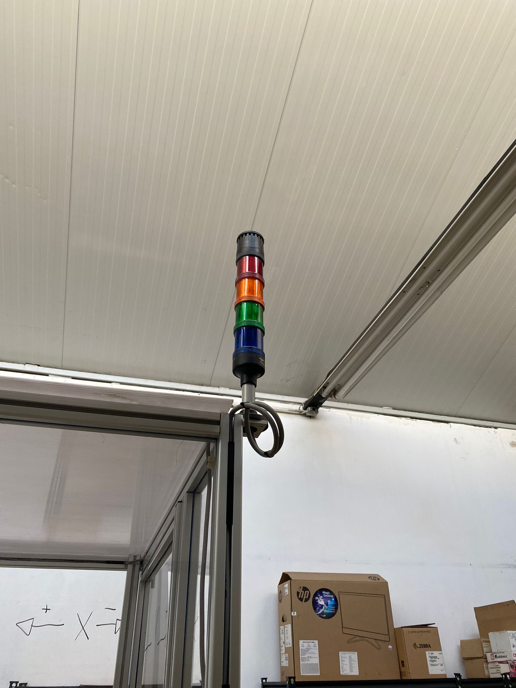
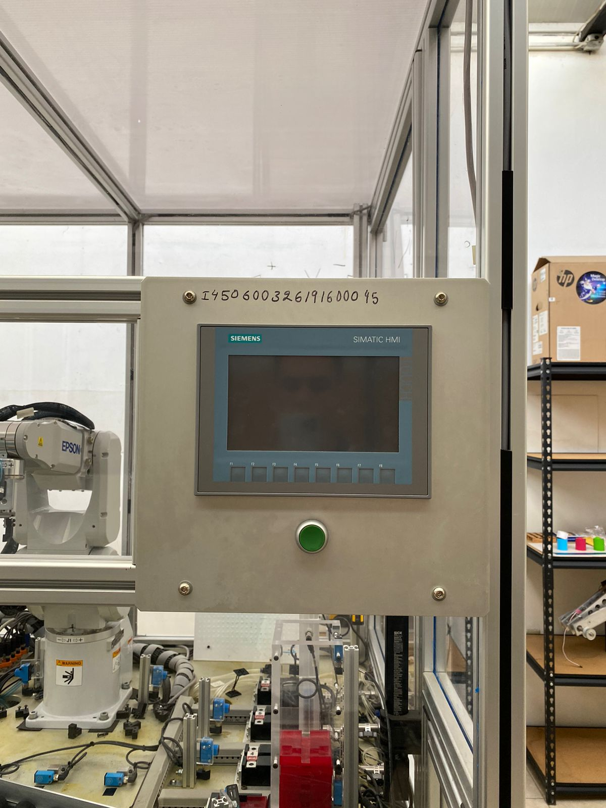
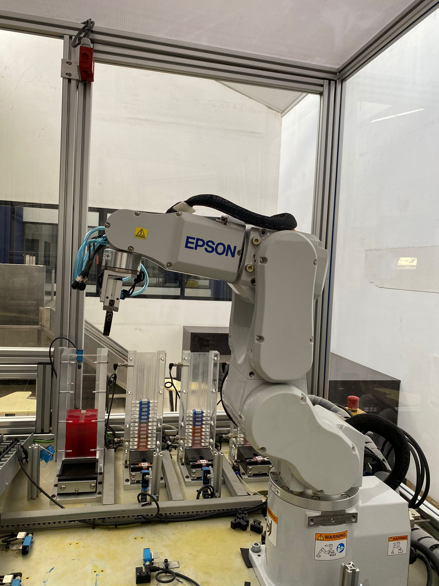

# Practica1

## Integrantes
  - Arriaga Ayala Juan Manuel
  - Ayala Bibriezca Antonio
  - Lóez Regalado Juan David 

## Introducción 
  La robótica ha evolucionado significativamente a lo largo de los años, proporcionando un control más preciso y eficiente, y creando sistemas robóticos cada vez más automáticos. En esta primera práctica, se introducen los primeros movimientos del brazo robótico disponible en el laboratorio y se busca familiarizar a los participantes con las articulaciones y eslabones del mismo.
  Epson RC+ ofrece un potente conjunto de herramientas y funciones que redefinen la eficiencia de la automatización. Para lograr una integración perfecta, Epson RC+ permite que todos los componentes puedan conectarse entre sí en un mismo entorno. Este avanzado conjunto de programas está incluido con la compra de los robots de 6 ejes y de los robots SCARA de Epson sin necesidad de pagar un cargo por la licencia en forma repetida.
  
# Instrucciones
  En primer lugar, se descargó el archivo comprimido proporcionado en la plataforma Teams. Posteriormente, se descomprimió el archivo y se accedió a la carpeta "EpsonRC70". Dentro de esta carpeta, se ejecutó el archivo "setup.exe", lo que desplegó una pantalla para la configuración del software. Se aceptaron los ajustes preestablecidos y, una vez completada la instalación, se creó un nuevo proyecto desde la ventana llamada "Project", seleccionando "New" y asignando un nombre al archivo para la práctica.

Se estableció una conexión USB entre el software y el brazo robótico, lo que permitió manipular el robot mediante los controles de la pestaña "Robot Manager". Durante la práctica, se identificaron los "Joints" (articulaciones) del robot y se configuraron para facilitar el control en futuras sesiones. Además, se revisaron los procedimientos para detener el robot en caso de emergencia o accidente al tener alguna colisión con algún objeto físico que no permita el movimiento del brazo. Para ello, se movió el brazo de derecha a izquierda con una potencia del 30% de su capacidad y se detuvo con el brazo de cada uno de los integrantes del equipo, observando como se detenía y se encendía un LED de color ámbar ubicado en la parte superior del brazo.

Finalmente, a continuación se muestran algunas fotografías tomadas del brazo, iniciando con los tres botones de paro de emergencia con los que cuenta el brazo:

Botón de paro de emergencia 1.

Botón de paro de emergencia 2.

Botón de paro de emergencia 3.

Se muestra también el semáforo que indica el funcionamiento del brazo:

Se muestra el display donde se configura la conexión del brazo con la computadora:

Y para terminar, se muestra la fotografía tomada del brazo robótico:

## Conclusiones
  El uso de brazos robóticos en la automatización de tareas industriales es cada vez más relevante debido al aumento en la demanda de productos y la necesidad de realizar tareas que pueden resultar más lentas y complejas para los humanos, como el manejo de grandes pesos y desplazamientos precisos. La práctica permitió a los participantes adquirir experiencia en el uso del software Epson RC+ y en la ejecución de los primeros movimientos del brazo robótico. Esta capacitación es esencial para mantenerse al día con las tecnologías emergentes y optimizar el uso de sistemas robóticos en entornos industriales.
## Referencias Bibliográficas

RC+ Desarrollo de automatización industrial VPL Software  | Epson México. (s. f.). https://epson.com.mx/software-desarrollo-automatizacion-industrial
